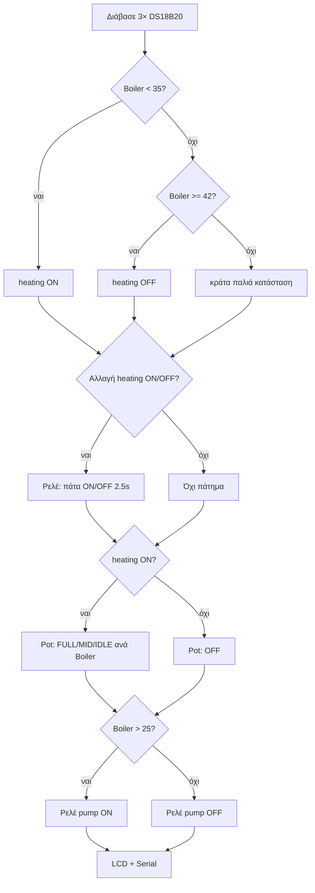

# H.T.C. — Hybrid Thermal Controller (Rev 1.0 · 2026)

Μελέτη ανασύνθεσης από: κώδικα Arduino, σχέδιο PCB (3 εικόνες), μνήμη χρήστη.  
Σχεδιαστής πλακέτας: **Romeos Tsakas**.

---

## 1. Τι ήταν το σύστημα (μία πρόταση)

**Έξυπνος «επιβάτης» πάνω στον κινέζικο καυστήρα Vevor:** δεν αντικαθιστάς την πλακέτα του· **πατάς το ON/OFF με ρελέ**, **ρυθμίζεις «θερμοκρασία» με ψηφιακό ποτενσιόμετρο** αντί για το μοχλό, και **κλείνεις/ανοίγεις κυκλοφορητές** από θερμοκρασίες νερού — με οθόνη και (στο PCB) θέσεις για περισσότερα.

---

## 2. Οι δύο «κώδικες» που βρήκες

Είναι **το ίδιο sketch** (ίδια pins, ίδια λογική). Πιθανόν δύο εκτυπώσεις/αντιγραφές, όχι δεύτερη έκδοση firmware. **Δεν χρειάζεται να διαλέξεις «ποιον» — όποιον κι αν ήταν, είναι ο ίδιος.**

**Επιβεβαίωση χρήστη (2026-05-18):** πρόχειρη καλωδίωση στον Vevor, ανταπόκριση τέλεια — αυτός ο κώδικας δούλευε.

**Φωτογραφίες πίνακα Vevor:** `photos/vevor_panel_wires_on_off.png` (2 καλώδια στο **μεσαίο πάνω** ON/OFF), `photos/vevor_panel_lcd_working.png`. Δείτε `ΣΤΟΧΟΣ_ΣΥΣΤΗΜΑΤΟΣ.md`.

Αποθηκεύτηκε: `firmware/vevor_hybrid_controller_v1.ino`

---

## 3. Τι κάνει ο κώδικας (αυτό που **σίγουρα** είχες προγραμματίσει)

### 3.1 Αισθητήρες (1-Wire, DS18B20)

| Index | Οθόνη LCD   | Ρόλος (από κώδικα)      |
|-------|-------------|-------------------------|
| 0     | Boiler      | Θερμοκρασία «λέβητα» / κύρια για λογική |
| 1     | Prosagogi   | Προσαγωγή               |
| 2     | Epistrofi   | Επιστροφή               |

Όλοι στο **pin D2** (OneWire bus).

### 3.2 Κύκλος θέρμανσης (hysteresis στο tempBoiler)

| Συνθήκη              | `isHeatingCycle` |
|----------------------|------------------|
| tempBoiler **< 35°C**  | ON (true)        |
| tempBoiler **≥ 42°C**  | OFF (false)      |
| 35–42°C              | κρατά προηγούμενη κατάσταση |

Όταν **αλλάζει** ON↔OFF → **ρελέ πατάει κουμπί Vevor 2,5 s** (`toggleVevorPower`).

Αυτό ταιριάζει με αυτό που θυμάσαι: ο καυστήρας σβήνει μόνος του· εσύ **αντιγράφεις το πάτημα** για να ξαναμπεί ή να συντονιστεί με τη δική σου λογική.

### 3.3 Κυκλοφορητής (ένα ρελέ στον κώδικα)

- **D4 = RELAY_PUMP**
- `tempBoiler > 25°C` → ρελέ **ON** (`LOW`, active-low module)
- αλλιώς OFF (`HIGH`)

Στην οθόνη: «Prosagogi / Epistrofi» — η **αντλία** οδηγείται από **Boiler > 25°C**, όχι από επιστροφή.

### 3.4 Ψηφιακό ποτενσιόμετρο Vevor (SPI)

- **D10 = CS**
- `SPI.transfer(0x11)` + byte τιμής → τυπικό **MCP41xxx** (8-bit pot), όχι το μοχλό του καυστήρα.

| Σταθερά     | Τιμή | Σχόλιο στον κώδικα |
|------------|------|-------------------|
| VEVOR_FULL | 128  | ~5°C setpoint     |
| VEVOR_MID  | 197  | ~22°C             |
| VEVOR_IDLE | 230  | ~35°C             |
| VEVOR_OFF  | 250  | ~40°C+ / σβήσιμο κύκλου |

Σε **θέρμανση** (isHeatingCycle):

- &lt; 37°C → FULL  
- 37–40°C → MID  
- 40–42°C → IDLE  

Σε **όχι θέρμανση** → OFF (250).

### 3.5 ON/OFF κουμπιού καυστήρα (ρελέ)

- **D7 = RELAY_VEVOR_BTN**
- Κανονικά HIGH (ρελέ ανοικτό)
- Στην αλλαγή κύκλου: LOW **2,5 s** → HIGH

Τα καλώδια που είχες κολλήσει στο μικροπλακέτακι ON/OFF του Vevor πάνε εδώ.

### 3.6 Οθόνη

- **I2C LCD 20×4**, διεύθυνση **0x27** (βιβλιοθήκη hd44780).

---

## 4. Pinout Arduino Nano (όπως στον κώδικα)

| Pin  | Λειτουργία        |
|------|-------------------|
| D2   | OneWire (DS18B20) |
| D4   | Ρελέ κυκλοφορητή   |
| D7   | Ρελέ ON/OFF Vevor |
| D10  | SPI CS (digital pot) |
| A4/A5| I2C LCD (default) |

**Δεν χρησιμοποιούνται στον αποθηκευμένο κώδικα:** buzzer, 2ο/3ο ρελέ, fan sense, servo, Wi‑Fi, RTC — αν και **η πλακέτα τα προβλέπει**.

---

## 5. Τι δείχνει η πλακέτα (PCB Rev 1.0) — σύγκριση με κώδικα

### 5.1 Δομή πλακέτας (από render / layout)

| Μπλοκ | Σκοπός (λογική) |
|-------|------------------|
| **Arduino Nano V3** (U10) | MCU — ταιριάζει με τον κώδικα |
| **2× Step-down 12V→5V** | Ένα για λογική/Arduino, ένα για **ρελέ 5V / φορτία** (όπως θυμάσαι) |
| **F2 1A** | Προστασία τροφοδοσίας |
| **U8 Digital potentiometer** | Αντικατάσταση μοχλού θερμοκρασίας Vevor |
| **LCD 20×4** | Παρακολούθθηση |
| **5V relay ON/OFF BURNER** | = RELAY_VEVOR_BTN στον κώδικα |
| **5V relay 2-channel** | Πιθανόν 2 κυκλοφορητές (στον κώδικα μόνο 1 pin) |
| **5V relay FUEL TEMPERATURE** | Στο PCB — **όχι στον κώδικα** |
| **Fan controller + H6 servo** | Για ανάγνωση/έλεγχο fan — **όχι στον κώδικα** |
| **H4 Water pressure, H5/H7/H8 θερμοκρασίες** | Περισσότερες θέσεις αισθητήρων |
| **Buzzer** | Συναγερμός — **όχι στον κώδικα** |
| **Digital clock, Wi‑Fi adapter** | Επέκταση — **όχι στον κώδικα** |
| **Level shifter P1** | I2C 3,3V↔5V αν χρησιμοποιηθεί ESP32 αργότερα |

### 5.2 Σημαντική διαφορά: σχηματικό vs layout

Σ μία από τις εικόνες το κεντρικό IC αναφέρεται ως **ESP32 DEVKIT** με pins RELAY_VEVOR=D14, PUMP=D27, κ.λπ.  
Εσύ διευκρινίζεις ότι **στο PCB που έφτιαξες μπήκε Nano** — οπότε:

- **Rev 1.0 PCB = Nano** (ταιριάζει με τον κώδικα που βρήκες).
- Αν υπάρχει **άλλο σχηματικό με ESP32**, είναι πιθανή **μελλοντική Rev 2** ή πρόχειρο σχέδιο — όχι αυτό που δοκίμασες με τον παλιό κώδικα.

---

## 6. Φιλοσοφία Vevor (αυτό που θυμάσαι + τι καλύπτει ο κώδικας)

### Συμπεριφορά καυστήρα (hardware)

1. Ρύθμιση μόνο με **μοχλό θερμοκρασίας** + **ON/OFF**.  
2. Όταν φτάσει setpoint → **σβήνει φλόγα**, **ανεμιστήρας συνεχίζει** μέχρι ~30°C εσωτερικά (~2–3 λεπτά).  
3. Μετά σβήνει και ο ανεμιστήρας· για **ξανά-έναρξη** πρέπει **πάτημα ON/OFF**.

### Τι έκανες εσύ

| Πρόβλημα | Λύση σου |
|----------|----------|
| Πρέπει να πας να πατήσεις ON/OFF | Ρελέ παράλληλα στο κουμπί → **2,5 s πάτημα** όταν αλλάζει ο **δικός σου** κύκλος θέρμανσης |
| Δεν θες να αγγίζεις μοχλό | **Ψηφιακό pot** στα ίδια σημεία (SPI) → FULL/MID/IDLE/OFF |
| Κυκλοφορητές | Τουλάχιστον **1 ρελέ** (pump) από θερμοκρασία λέβητα |
| Παρακολούθηση | **3× DS18B20** + **LCD 20×4** |

### Τι θυμάσαι αλλά **δεν είναι** στον αποθηκευμένο κώδικα

- **2–3 επιπλέον ρελέ** κυκλοφορητών (η πλακέτα έχει 2-channel relay — πιθανόν 2 pumps).
- **Fan controller / μέτρηση χρόνου ανεμιστήρα** (σύρματα στο καλώδιο fan) — έξυπνη ιδέα για τη φάση «φλόγα OFF, fan ON»· χρειάζεται **άλλο sketch** ή επέκταση.
- **Buzzer συναγερμού** — υπάρχει footprint, όχι στον κώδικα.
- **Αισθητήρας πίεσης νερού** (H4) — footprint, όχι στον κώδικα.

→ Λογικό συμπέρασμα: **η πλακέτα σχεδιάστηκε πλουσιότερη** από το **τελευταίο firmware** που κράτησες, ή το υπόλοιπο ήταν **φάση 2** πριν ξεμοντάρεις.

---

## 7. Διάγραμμα λογικής (απλό)



---

## 8. Προτάσεις για νέα κατασκευή (ESP32 30 pin)

| Θέμα | Πρόταση |
|------|---------|
| MCU | **ESP32 DevKit 30 pin** — Wi‑Fi, περισσότερα GPIO, RTC |
| PCB | Νέα **Rev 2** — μην «κουμπώσεις» Nano footprint αν πας ESP32 |
| Level shifter | Κράτα **P1** για I2C LCD 5V |
| Ρελέ | Ίδια φιλοσοφία· σκέψου **opto-isolation** / fuse / ξεχωριστά 5V για ρελέ |
| Fan | Υλοποίησε τέλος τη μέτρηση fan (GPIO + pull-up ή frequency) — κρίσιμο για Vevor |
| Κώδικας | Μεταφορά pins + `delay(2500)` μόνο σε task, όχι block (ESP32) |
| Ασφάλεια | Όριο θερμοκρασίας, buzzer, watchdog — **δεν υπήρχαν στον παλιό κώδικα** |

Πιθανός χάρτης ESP32 (πρόχειρο — θα οριστεί στο σχηματικό Rev 2):

| Λειτουργία | Προτεινόμενο ESP32 pin (από draft σχηματικού) |
|------------|-----------------------------------------------|
| OneWire    | GPIO4 |
| SPI CS pot | GPIO33 |
| Relay Vevor| GPIO14 |
| Relay pump | GPIO27 |
| Relay valve| GPIO26 |
| I2C LCD    | 21/22 + level shifter |

---

## 9. Επόμενα βήματα (όταν θες)

1. Βρες αρχεία **KiCad / EasyEDA** (.kicad_pro, .json) αν υπάρχουν — όχι μόνο screenshots.  
2. Αποφάσισε **Rev 1 (Nano, ίδιο PCB)** vs **Rev 2 (ESP32, νέα παραγγελία)**.  
3. Λίστα «τι μπαίνει σίγουρα» vs «τι κόβουμε» (Wi‑Fi, RTC, pressure…).  
4. Νέο ενιαίο firmware με ό,τι κρατάς + fan logic + buzzer.

---

## 10. Αρχεία σε αυτόν τον φάκελο

```
πλακέτα ελέγχου καυστήρα Vevor/
  ΜΕΛΕΤΗ_HTC_Rev1.md          ← αυτό το έγγραφο
  firmware/
    vevor_hybrid_controller_v1.ino
```

Τιμολογιακά οι δύο σελίδες κώδικα = **μία έκδοση firmware**· η πλακέτα = **H.T.C. carrier** για Nano + modules (ρελέ, step-down, pot, LCD, επεκτάσεις).
